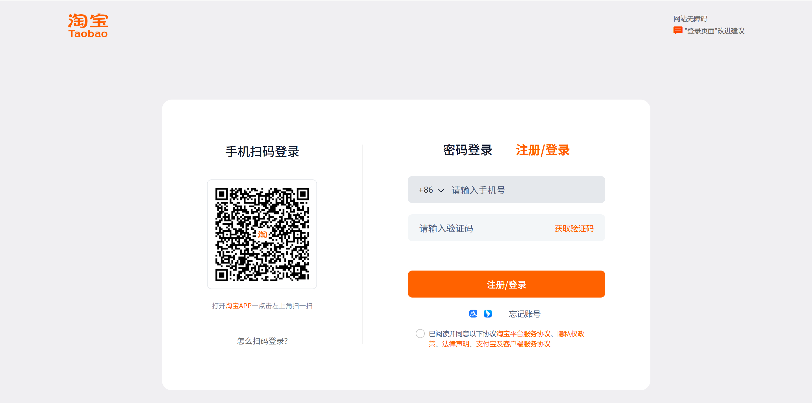

# Taobei Login System

A phone verification login system with Taobao-inspired UI design, built with React TypeScript and Node.js.



## Features

- 📱 Phone number verification with Chinese mobile validation
- 🎨 Taobao-style orange theme UI design
- 🔐 JWT authentication and secure sessions
- 📱 Responsive design for all devices
- 🧪 Test-driven development with comprehensive coverage

## Quick Start

### Prerequisites
- Node.js 16+
- npm

### Setup
```bash
# Clone and install
git clone https://github.com/xilinyu716/SE-Temp.git
cd SE-Temp

# Backend setup
cd backend && npm install
cp .env.example .env

# Frontend setup
cd ../frontend && npm install
```

### Run
```bash
# Start backend (Terminal 1)
cd backend && npm run dev

# Start frontend (Terminal 2)  
cd frontend && npm run dev
```

Visit http://localhost:5173 to use the application.

## Technology Stack

**Frontend:** React 18, TypeScript, Vite, Vitest  
**Backend:** Node.js, Express, SQLite, JWT, Jest

## API Endpoints

- `POST /api/auth/send-code` - Send verification code
- `POST /api/auth/login` - Login with phone/code
- `POST /api/auth/register` - Register new user
- `GET /api/user/profile` - Get user profile

## Testing

```bash
# Backend tests
cd backend && npm test

# Frontend tests
cd frontend && npm test
```

## License

MIT License